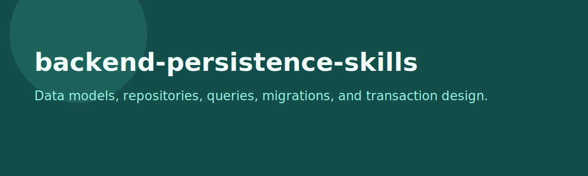

# backend-persistence-skills

<p align="center">
  
</p>

<p align="center">
  
</p>

<p align="center">
  <a href="LICENSE"></a>
  
  
</p>

A platform-neutral backend persistence skill pack for data modelling, repository design, schema review, ORM decisions, transaction boundaries, query analysis, and migration planning.

## Included skills

- `api-contract-writer`
- `api-error-model-designer`
- `crud-surface-reviewer`
- `dao-pattern-builder`
- `data-migration-planner`
- `entity-model-designer`
- `index-suggestion-writer`
- `jdbc-vs-jpa-selector`
- `orm-mapping-reviewer`
- `persistence-test-planner`
- `query-complexity-reviewer`
- `repository-layer-designer`
- `schema-normalizer`
- `transaction-boundary-checker`

## Features

- Preserves the original `skills/`, `templates/`, and `examples/` source material
- Mirrors packaged skills into both `.claude/skills/` and `.agents/skills/`
- Covers persistence design from entity modelling through testing and migration

## Install

### Option A: Install globally

```bash
git clone https://github.com/45ck/backend-persistence-skills.git
cd backend-persistence-skills
bash install.sh
```

This installs every packaged skill into both:

- `~/.claude/skills/`
- `~/.agents/skills/`

### Option B: Copy into a project

```bash
cp -R .claude /path/to/your-project/
cp -R .agents /path/to/your-project/
```

### Uninstall

```bash
bash uninstall.sh
```

## Usage

```text
/entity-model-designer subscription billing data model
/schema-normalizer audit current relational schema
/repository-layer-designer order processing module
/transaction-boundary-checker checkout and payment capture workflow
/query-complexity-reviewer reporting query hotspots
/data-migration-planner move users from legacy auth schema
```

## Repo structure

```text
skills/                              original source skills
templates/                           reusable templates
examples/                            sample flow material
.claude/skills/<skill>/SKILL.md      packaged skill format
.agents/skills/<skill>/SKILL.md      mirrored packaged skill format
install.sh                           global installer
uninstall.sh                         global uninstaller
LICENSE                              MIT
```

## Related skill packs

- [software-architecture-skills](https://github.com/45ck/software-architecture-skills) - Architecture options, views, risks, and tradeoff writing
- [web-engineering-skills](https://github.com/45ck/web-engineering-skills) - Web request handling, MVC, validation, routing, and navigation skills
- [enterprise-architecture-integration-skills](https://github.com/45ck/enterprise-architecture-integration-skills) - Enterprise topology, integration, messaging, and cloud skills
- [uml-analysis-modelling-skills](https://github.com/45ck/uml-analysis-modelling-skills) - UML analysis and modelling skills
- [business-analysis-skills](https://github.com/45ck/business-analysis-skills) - Business analysis techniques, workflows, and quality checks
- [marketing-product-skills](https://github.com/45ck/marketing-product-skills) - Product strategy, growth, positioning, launch, SEO, and pricing skills
- [hci-review-skill](https://github.com/45ck/hci-review-skill) - Structured HCI and UX review skills
- [fagan-inspection-skill](https://github.com/45ck/fagan-inspection-skill) - Formal inspection and defect-review skills

## License

[MIT](LICENSE)
